# Ball and Plate — Control Systems Comparison

> Experimental Ball and Plate platform for comparing classical, modern, and biologically inspired control strategies.

[](https://www.mathworks.com/)
[](https://www.arduino.cc/)
[](https://www.solidworks.com/)

<p align="center">
  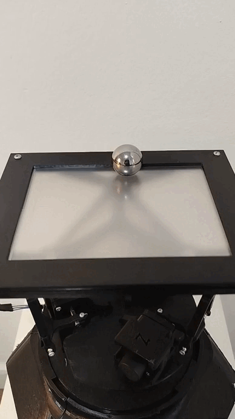
</p>

## Overview

This project presents the design and experimental implementation of a **Ball and Plate system** developed as a platform for studying and comparing different control approaches.

The system consists of a mobile platform whose inclination is controlled to regulate the position of a ball on its surface. Because the plant is nonlinear and inherently unstable, the platform provides a practical testbed for evaluating controller performance under real physical conditions.

The project was developed as an undergraduate Mechatronics Engineering thesis at **Universidad Autónoma de Occidente** in 2025.

The study compares:

- **PID control**
- **Discrete LQR control with integral action**
- **Biologically inspired neural-network-based control**

The experimental evaluation considers parameters such as settling time, overshoot, position regulation, stability, and response to different reference trajectories.

## Project Objectives

The main objective was to design and implement a Ball and Plate system to compare modern control algorithms with biologically inspired neural networks.

The project included:

1. Designing and constructing the physical Ball and Plate platform.
2. Implementing the sensing, processing, actuation, and communication subsystems.
3. Developing a mathematical model of the system.
4. Implementing a classical PID controller.
5. Designing and implementing a discrete LQR controller.
6. Developing a biologically inspired sensoriomotor neural architecture.
7. Experimentally evaluating and comparing the controllers.

## System Architecture

The complete system integrates:

```text
                ┌──────────────────────┐
                │      Ball Position   │
                │        Sensing        │
                └──────────┬───────────┘
                           │
                           ▼
                ┌──────────────────────┐
                │  Embedded Processing │
                │        ESP32         │
                └──────────┬───────────┘
                           │
             ┌─────────────┼─────────────┐
             │             │             │
             ▼             ▼             ▼
          PID            LQR        Neural Control
             │             │             │
             └─────────────┼─────────────┘
                           │
                           ▼
                ┌──────────────────────┐
                │      Actuators       │
                └──────────┬───────────┘
                           │
                           ▼
                ┌──────────────────────┐
                │    Mobile Platform   │
                │     Ball & Plate     │
                └──────────────────────┘
```

## Mechanical Design

The platform was designed as a **3RRS parallel mechanism**, inspired by the kinematic principles of Stewart platforms.

The thesis explicitly treats the system as a simplified parallel mechanism rather than a full six-degree-of-freedom Stewart platform.

The mechanical development included:

- Fixed base
- Mobile platform
- Actuator mounting brackets
- Motor arms
- Passive links
- Spherical joints
- Structural enclosure
- 3D-printed components
- Complete mechanical assembly

The design process included CAD modeling, material selection, manufacturing considerations, and physical assembly.

## Mathematical Modeling

A mathematical model was developed to describe the dynamics of the Ball and Plate system.

The modeling process included:

- Definition of coordinate systems and state variables
- Kinematic relationships
- Kinetic-energy analysis
- Potential-energy analysis
- System equations
- Linearization around the equilibrium point
- Actuator modeling
- Inverse kinematics

The linearized model was subsequently used for the modern control design.

## Control Strategies

### 1. PID Controller

A PID controller was implemented as a classical control baseline.

The proportional, integral, and derivative gains were adjusted heuristically to obtain a stable response suitable for experimental operation.

The PID controller was used as an accessible baseline for evaluating the more advanced approaches.

### 2. Discrete LQR Controller

A discrete Linear Quadratic Regulator was designed using the linearized system model.

The controller incorporates integral action to reduce steady-state error for non-zero references.

The design process included:

- State-space modeling
- System augmentation with an integral state
- Selection of weighting matrices using Bryson's rule
- Zero-Order Hold discretization
- Discrete controller implementation

The experimentally obtained gain parameters reported in the thesis include:

```text
Kp = [0.3717249833, 0.6492662298, 4.7860201182, 3.0881250565]
Ki = -0.0989469993
```

### 3. Biologically Inspired Neural Controller

The project also implements a biologically inspired sensoriomotor controller.

Its architecture is based on concepts inspired by biological visuomotor pathways and sensoriomotor transformations.

The network incorporates:

- Spatial coding
- Auxiliary neural layers
- Internal neuronal dynamics
- Activation conversion
- Modular organization
- Recurrent inhibitory interactions
- Motor neurons

The neural activity changes according to the position and movement of the ball. The auxiliary layers exhibit stronger activation when the ball is far from the center and lower activation as the ball approaches the desired equilibrium.

## Experimental Results

The controllers were experimentally evaluated using the physical Ball and Plate system.

The thesis reports the following measurements for the LQR and biologically inspired neural controllers:

| Controller | Axis | Maximum Position (m) | Overshoot | Settling Time |
|---|---:|---:|---:|---:|
| Neural | X | 0.145754 | 34.89% | 9.829 s |
| Neural | Y | 0.132814 | 36.17% | 9.703 s |
| Discrete LQR | X | 0.166377 | 44.32% | 7.961 s |
| Discrete LQR | Y | 0.121640 | 29.13% | 7.212 s |

The experiments also included reference trajectories with different geometries, including:

- Ellipse
- Square
- Infinity-shaped trajectory

The reported experimental results show that the discrete LQR achieved shorter settling times, while the biologically inspired controller exhibited lower overshoot on the X axis.

### Trajectory Tracking Gallery

For each reference trajectory, the platform's video response is shown alongside the tracked ball trajectory.

| Ellipse | Square | Infinity |
|:---:|:---:|:---:|
| 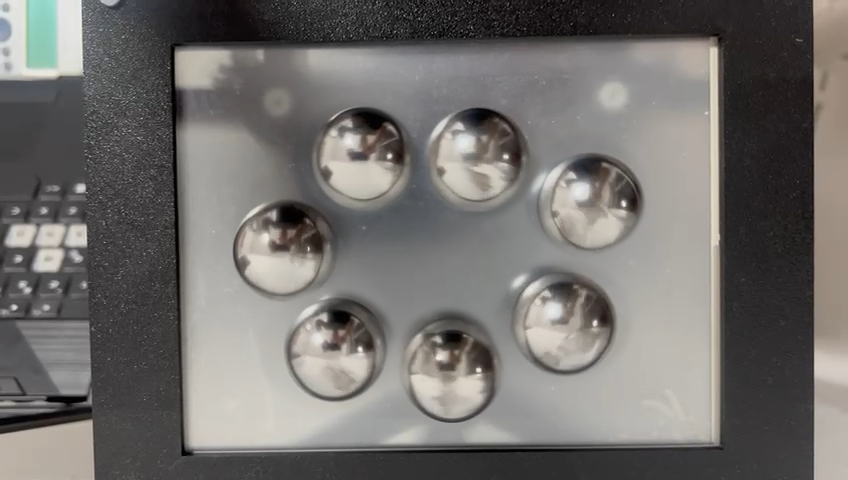<br>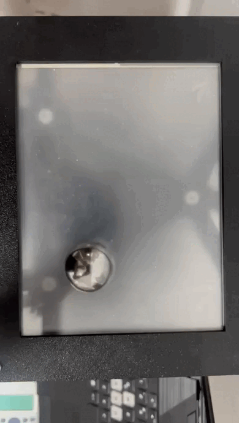<br>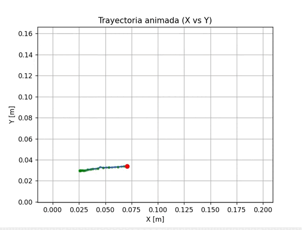 | 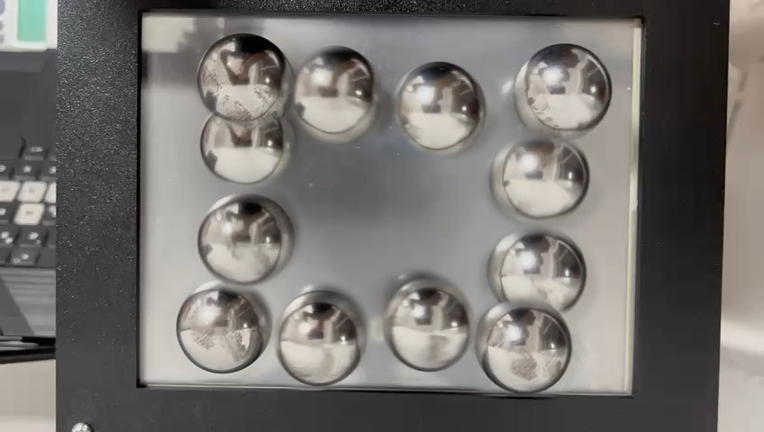<br>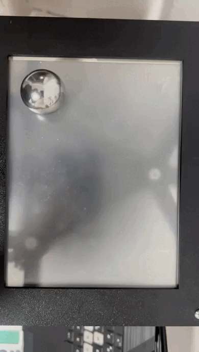<br>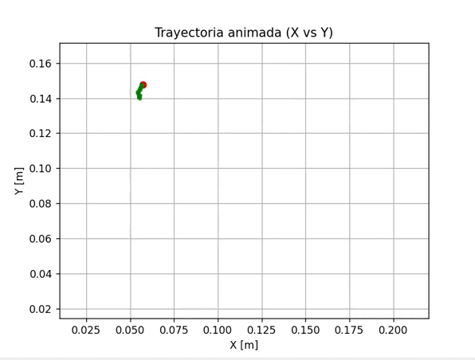 | 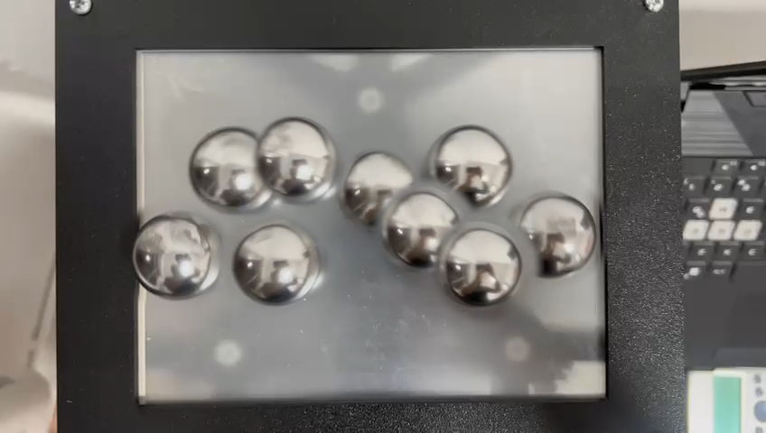<br>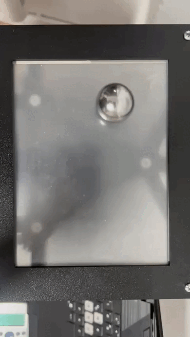<br>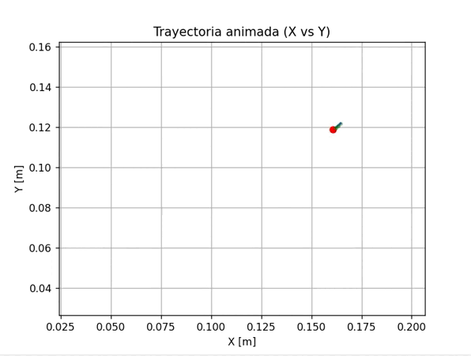 |

*Top: reference setup photo · Middle: platform response video · Bottom: recorded ball trajectory*

### Controller Demonstrations

| Neural Controller | Follower / Tracking Demo |
|:---:|:---:|
| 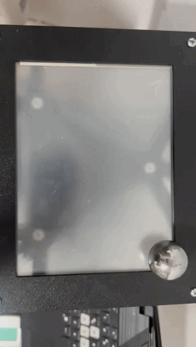 | 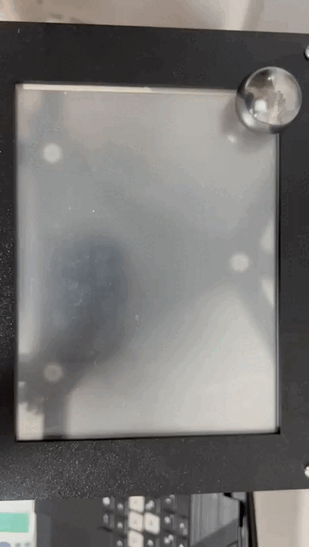 |

## Technologies

### Control & Modeling

- MATLAB
- State-space modeling
- PID control
- Discrete LQR / LQI
- Linearization
- Inverse kinematics

### Embedded Systems

- ESP32
- Arduino ecosystem
- Real-time control
- Sensor acquisition
- Actuator control
- Digital communication

### Mechanical Design

- SolidWorks
- CAD modeling
- Parallel mechanisms
- 3D-printed components
- Mechanical assembly

### Neural Control

- Biologically inspired neural networks
- Sensoriomotor transformations
- Recurrent inhibition
- Modular neural architectures

## Hardware

The thesis documents the selection and integration of:

- Camera-based ball-position sensing
- ESP32-based processing
- Actuators for platform inclination
- Electronic control hardware
- Mechanical links and spherical joints
- Custom-designed structural components

Component selection was performed through comparative screening matrices considering technical, operational, and economic criteria.

## Communication and Software

The system includes communication between the sensing, processing, control, and actuation subsystems.

The thesis also documents a graphical user interface (GUI) for interaction with the system and visualization of relevant information.

## Repository Structure

```text
ball-and-plate/
│
├── README.md
├── docs/
│   ├── thesis.pdf
│   ├── electronics/
│   └── diagrams/
│
├── cad/
│   ├── parts/
│   └── assembly/
│
├── src/
│
├── modeling/
│   ├── dynamics/
│   └── kinematics/
│
└── media/
    ├── images/
    └── videos/

```

> The structure above is a recommended organization for the repository. It should be adjusted to match the actual files included in the project.

## Key Engineering Topics

This project combines several areas of mechatronics and robotics:

- Control engineering
- State-space systems
- Optimal control
- Nonlinear-system analysis
- Parallel mechanisms
- Robot kinematics
- Embedded systems
- Computer vision
- Neural computation
- CAD and mechanical design
- Experimental validation

## Thesis

**Comparison of Modern Control and Biologically Inspired Neural Networks in the Implementation and Design of a Ball and Plate System**

**Authors:** Diego Alejandro Caro Vaca and Brian Steven Realpe Meneses  
**Program:** Mechatronics Engineering  
**Institution:** Universidad Autónoma de Occidente  
**Year:** 2025

The complete thesis contains the detailed mechanical design, component selection, mathematical modeling, controller design, neural architecture, experimental methodology, and results.

## Project Highlights

- Physical implementation of a Ball and Plate platform.
- 3RRS parallel mechanism.
- Mathematical modeling and linearization.
- Classical PID control.
- Discrete LQR with integral action.
- Biologically inspired sensoriomotor neural control.
- Experimental comparison using settling time and overshoot.
- Reference trajectory tracking.
- Integration of mechanical, electronic, sensing, and control subsystems.

## Authors

**Diego Alejandro Caro Vaca**  
Mechatronics Engineering

**Brian Steven Realpe Meneses**  
Mechatronics Engineering

---

*This repository documents an academic engineering project developed as part of a Mechatronics Engineering thesis.*
